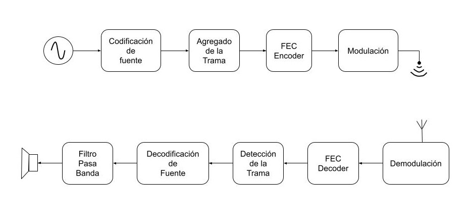

# Implementación de Transmisión y Recepción Digital con GNU Radio

**Autores: Lema, Adan J.A. - Paz, Matias J.**

Este proyecto se centra en el proceso completo de concepción y operación de un transmisor y receptor de audio, diseñados y realizados mediante el empleo de GNU Radio. Su objetivo principal es proporcionar una exposición detallada y exhaustiva que abarque desde el diseño inicial hasta las pruebas realizadas en un sistema de transmisión y recepción de señales de audio. Este proyecto se sitúa en el contexto de la aplicación práctica de los conocimientos adquiridos durante el curso de Sistemas de Comunicaciones Digitales I.

